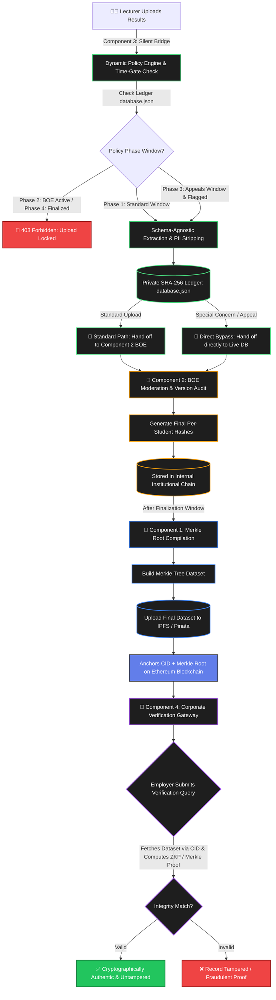

<div align="center">
  

  <!-- Animated typing effect -->
  

  <br />

  [](#)
  [](#)
  [](#)
  [](#)
  [](#)
</div>

<h1 align="center">🎓 Blockchain-Based Transparent and Secure Academic Grading Using Decentralized Verification</h1>

---

## 🎯 The Real-World Problem

The problem is **NOT** just that "lecturers might alter marks." 

The *real core challenges* span across transcript trust, institutional compliance, and review workflow vulnerabilities:
> **Students can easily fake, edit, or forge academic result sheets when applying for employment or higher education, while employers and verification bodies lack a tamper-proof, decentralized mechanism to independently authenticate academic achievements.**

### Current Limitations:
- ❌ **Centralized Vulnerabilities**: Traditional university grading records reside in closed databases vulnerable to unauthorized internal alterations or single points of failure.
- ❌ **Lack of Cryptographic Proof**: Verifying paper transcripts or digital PDFs relies entirely on manual phone calls or institutional email follow-ups.
- ❌ **Unregulated Review Windows**: Traditional systems lack automated, time-locked institutional boundaries to safely govern standard grading uploads versus formal grade appeals and Board of Examiners (BOE) reviews.
- ❌ **Transcript Fraud & Document Forgeries**: The widespread availability of PDF editing tools enables fraudulent grade inflations that bypass legacy verification workflows.
- ❌ **Schema Rigidity**: Academic departments utilize heterogeneous grading formats (Excel/CSV layouts with varying rubrics), preventing seamless, automated processing.

---

## ✅ Our Main Solution

We engineered **Silent Bridge**, a multi-phase, blockchain-anchored academic verification middleware and portal architecture that introduces:
- **Autonomous Time-Gate Enforcement**: Dynamic institutional policy windows that automatically lock or unlock academic portals based on decentralized phase intervals.
- **Context-Aware Routing**: Intelligent workflow branching that separates standard lecturer submissions from formal re-corrections and grade appeals.
- **Cryptographic Provenance Ingestion**: Schema-agnostic file parsing, duplicate payload rejection (idempotency control), and PDPA-compliant data masking (stripping PII while anchoring verifiable scores).
- **Independent Third-Party Verification**: Allowing employers and verification authorities to mathematically authenticate candidate transcripts via IPFS and zero-knowledge proofs without trusting vulnerable PDF screenshots.

### 🛠 Technologies Used
- **SHA-256 Hashing & Private Ledger (`database.json`)**: For cryptographically linked, append-only local block anchoring and duplicate payload interception.
- **SheetJS (`xlsx`)**: For schema-agnostic extraction and parsing of heterogeneous LMS Excel/CSV grading sheets.
- **Dynamic Institutional Policy Engine (`system-config.json`)**: Configurable governance engine supporting flexible time units (Days for production, Minutes for live demo testing).
- **Merkle Trees & IPFS (Pinata)**: For hierarchical dataset compilation and decentralized storage of finalized academic records.
- **Ethereum Blockchain**: For immutable anchoring of system proofs and Merkle roots.
- **React.js, Vite & Tailwind/CSS**: For modern, highly responsive lecturer, administrator, and corporate verification portals featuring live ticking clocks and timezone-localized timeline scanners.
- **Cloud Infrastructure**: Live production deployment integrated across **Vercel** (Frontend portal) and **Railway** (Decentralized middleware backend), with automated fallback routing and real-time network resilience banners.

---

## 🧩 Overall System Flow



---

## 🏗 System Components

<details open>
<summary><b>🧩 COMPONENT 3 — DATA INGESTION LAYER & CLOUD ARCHITECTURE (Silent Bridge)</b></summary>

### 🎯 Purpose
Acts as the secure, decentralized "front door" of the system. It handles manual lecturer uploads, dynamically standardizes schema heterogeneity, seals records into a temporary private cryptographic ledger, and automatically manages cloud-native synchronization and automated Board of Examiners (BOE) handoffs.

#### ✅ Core Engineering & Recent Enhancements
- **Schema-Agnostic Parsing**: Utilizes `SheetJS` to dynamically extract complex, heterogeneous grading rubrics (e.g., Assignment 1, Midterm, Final, Marks, Grades) without breaking.
- **PDPA Privacy Compliance**: Automatically strips Personally Identifiable Information (PII) like names and emails, anchoring only Candidate IDs and Grades.
- **Cryptographic Private Ledger**: Replaces standard databases with a mathematically linked, append-only JSON blockchain. Every upload generates a SHA-256 `blockHash` tied to the `previousHash`.
- **Idempotency Control (Duplicate Rejection)**: Deterministically calculates payload hashes to intercept and reject duplicate file uploads before they consume network bandwidth.
- **Context-Aware Routing**: UI includes a bypass flag allowing lecturers to mark specific uploads as formal "Re-corrections," altering downstream BOE handling.
- **Live Cloud-Native Architecture**: Fully decoupled and deployed across **Vercel** (for high-speed global frontend delivery) and **Railway** (`https://r26-se-011-production.up.railway.app`) for the persistent decentralized middleware backend.
- **Automated Cloud-to-Cloud Handoffs**: Direct, secure server-to-server payload synchronization routing verified grades automatically to the Board of Examiners (BOE) layer hosted on Render (`https://component-2-boe-backend.onrender.com/api/boe/ingest`).
- **Real-Time Network Resilience & Auto-Sync Banners**: Built-in fallback error-handling that safely secures blocks locally even if cloud endpoints experience brief latency, paired with interactive UI banners allowing manual or automatic re-syncing.
- **Dynamic Localized Module Scanner**: A real-time UI dashboard tracking system time-gates (Standard Entry, BOE Review, Special Concerns, and Finalized) that automatically synchronizes and localizes countdowns to the user's local operating system timezone.

#### ✅ Output & Handoff to Component 2
Sends a strictly standardized API contract to the BOE Layer (`https://component-2-boe-backend.onrender.com/api/boe/ingest`). The payload includes critical cryptographic metadata and the context-routing flag:
```json
{
  "metadata": {
    "provenanceHash": "916592246832a4d97d5cbdb310389cc510c4ed2888e2c954d77d53ef054827ae",
    "moduleCode": "SE4010",
    "uploaderName": "Dr. Nithika Perera",
    "isRecorrection": false,
    "source": "COMPONENT_3_SILENT_BRIDGE"
  },
  "records": [
    {
      "candidateId": "IT22061348",
      "gradingData": { "Credits": "4", "Final Grade": "A+" }
    }
  ]
}
```

### 🚀 How to Run and Test Component 3 Locally

To run the complete end-to-end Component 3 pipeline (Frontend, Middleware, Mock Server, and Policy Admin), open **three separate terminal windows**:

#### 🗂️ 1. Terminal 1: Start the Middleware Server
Open a first terminal, navigate to the middleware folder, and start the backend stand-in (runs on port 5000):
```bash
cd middleware
node src/server.js
```

#### 🛠️ 2. Terminal 2: Start the Mock Component 2 Server
Navigate to your middleware folder and boot the main Node.js server (runs on port `5001`):
```bash
cd middleware
node src/mock-server.js
```
#### 💻 3. Terminal 3: Start the React Frontend
Open a third terminal, navigate to your frontend directory, install dependencies, and launch the Vite development server:
```bash
cd frontend
npm install
npm run dev
```
#### 🧪 Live Testing Guide for Presentations
- **System Admin Portal:**: Click into the Admin Gateway to configure your institutional windows. Switch the time unit to "Minutes" (e.g., Standard Window = 1 min, BOE Window = 2 min, Appeals = 3 min) and click Deploy.
- **Lecturer Portal**:Sign in via institutional SSO, view the Live Module Scanner (which dynamically projects and localizes lock/unlock times to your exact OS timezone), drop an `.xlsx` or `.csv` grading sheet, enter a module code (e.g., `SE4010`), and click Verify & Ledger Upload.
- **Time-Gate Enforcement**: Watch the system autonomously lock uploads once the policy window elapses, or test the Re-correction / Grade Appeal toggle to trigger context-aware routing bypass straight to the mock server!

</details>

<details>
<summary><b>🧩 COMPONENT 2 — BOE REVIEW & CORRECTION LAYER</b></summary>

### 🎯 Purpose
Allows official academic corrections safely by the Board of Examiners (BOE).

#### ✅ Why This Exists
Results sometimes need moderation, appeal corrections, or calculation fixes. Normal systems overwrite old results. This component keeps version history, audit logs, and correction tracking.

#### ✅ Workflow
`BOE Login` ➔ `Search Student` ➔ `Edit Result` ➔ `Save Correction` ➔ `Version Updated` ➔ `Hash Generated`

#### ⚠️ Important Design Decision
Component 2 hashes ONLY:
`Student ID + Module Code + Final Grade` (e.g., `IT001 + SE4010 + A`). 
*Not timestamps, comments, or lecturer names.* This ensures Component 4 can regenerate the SAME hash during verification.

#### 🔒 Private Offline Blockchain
Component 2 stores all student hashes in an internal institutional chain. This is a temporary secure ledger containing per-student hashes during the correction period.

#### ⏳ Two-Week Finalization Window
During this time, corrections are allowed and hashes are updated. After the deadline, the dataset becomes **FINALIZED**.
</details>

<details>
<summary><b>🧩 COMPONENT 1 — BLOCKCHAIN PROOF LAYER</b></summary>

### 🎯 Purpose
Creates the FINAL tamper-proof system.

#### ✅ Process
1. **Build Merkle Tree**: Combine all finalized hashes from Component 2.
2. **Generate Merkle Root**: Represents the ENTIRE dataset. If ANY student grade changes, the Merkle Root changes completely.
3. **Create Final Dataset JSON**:
    ```json
    [
      {
        "studentId": "IT001",
        "moduleCode": "SE4010",
        "grade": "A+",
        "hash": "zzz999"
      }
    ]
    ```
4. **Store Dataset in IPFS**: Upload finalized dataset using Pinata. IPFS returns a unique CID (Content Identifier).
5. **Blockchain Anchoring**: Store the **CID** and **Merkle Root** on Ethereum. (We don't store full student records to save blockchain storage costs).
</details>

<details >
<summary><b>🧩 COMPONENT 4 — VERIFICATION LAYER</b></summary>

### 🎯 Purpose
Allows employers/students to verify authenticity. 
*Note: Component 4 DOES NOT compare with CID directly. CID is only used to retrieve the FINAL dataset from IPFS.*

#### 🏢 Employer Portal Features
1. **View Results**: Employer inputs `Student ID` and sees the grades.
2. **Verify Authenticity**: Employer inputs `Student ID`, `Module Code`, and `Grade`.

#### ✅ Verification Workflow
1. **Generate Verification Hash**: e.g., `hash(IT001 + SE4010 + A+) -> zzz999`
2. **Retrieve Final Dataset**: From IPFS using CID anchored on the blockchain.
3. **Find Stored Student Hash**: Look up the student in the downloaded JSON.
4. **Compare Hashes**:
   - `generatedHash == storedHash` ➔ **✅ VALID**
   - `generatedHash != storedHash` ➔ **❌ INVALID**
5. **Merkle Proof Verification**: Verifies that this student hash belongs to the official Merkle Root stored on the blockchain, proving it's officially part of the finalized university dataset.

> **💡 Why VALID/INVALID makes sense:** The employer is verifying whether the *STUDENT'S CLAIM* matches the officially finalized university record.
</details>

---

## 🔥 Final System Benefits
- ✅ **Tamper-Resistant Academic Proof:** Eliminates fake transcripts, PDF forgery, and unverified grade alterations.
- ✅ **Automated Multi-Phase Time-Gating:** Enforces rigid operational windows (Standard Entry, BOE Review, Appeals, Finalization) programmatically.
- ✅ **Context-Aware Appeal Routing:** Seamlessly handles standard entries versus formal re-correction overrides.
- ✅ **Idempotency & Bandwidth Protection:** Intercepts duplicate payloads to prevent redundant ledger bloat.
- ✅ **Configurable Institutional Governance:** Dynamic policy engine permits tailoring of time windows to fit diverse university rules without hardcoding.
- ✅ **PDPA Privacy Compliant:** Strips sensitive personal identifiers while maintaining full candidate verification integrit
- ✅ **Decentralized Trust Model:** Empowers employers to independently verify records via IPFS and Ethereum without manual university intervention.

---

## 📈 Current Status of Components

| Component | Status |
| :--- | :--- |
| **Component 1** | 🟢 Hashing + Merkle + IPFS completed |
| **Component 2** | 🟢 BOE APIs + Versioning + Hashing completed |
| **Component 3** | 🟢 Silent Bridge, dynamic time-gates, schema parser, idempotency, live cloud synchronization (Vercel & Railway), live module scanner & admin dashboard completed|
| **Component 4** | 🟢 ZKP verification backend completed |

---

## 🌿 Repository Branch Structure (Implementation History)

The development of this project was modularized into distinct branches to isolate component logic and ensure parallel development. Below is the breakdown of the actual implemented features tracked across our Git branches:

### 🟩 Component 1: Blockchain Proof Layer
- `feature/component-01-hashing` - Core SHA-256 data hashing logic.
- `feature/component-01-merkle-tree` - Merkle Tree construction and Root generation.
- `feature/component-01-ipfs` - Pinata IPFS integration and CID management.

### 🟦 Component 2: BOE Review & Correction Layer
- `feature/component-02-backend-setup` - Core API setup for the Board of Examiners.
- `feature/component-02-frontend` - BOE review interface and student lookup.
- `feature/component-02-core-revision` - Modification handlers and result overrides.
- `feature/component-02-audit-version` - Version history tracking and audit logs.
- `feature/component-02-deadline-hash` - Two-week finalization logic and temporary hash anchoring.

### 🟪 Component 3: Data Ingestion Layer
- `feature/component-03-frontend-setup` - Initial lecturer portal UI.
- `feature/component-03-backend-setup` - Lecturer authentication and upload API.
- `feature/component-03-extraction-engine` - Excel/CSV parsing and LMS format standardization.
- `feature/component-03-hashing-ledger` - Duplicate prevention and initial hashing.
- `feature/component-03-verification-portal` - Verification portal UI setup.
- `component-03-silent-bridge` - Final integration point for the ingestion phase.

### 🟧 Component 4: Verification Layer
- `component4-zkp-formal-verification` - Zero-Knowledge Proof (ZKP) logic and final employer verification mechanisms.

---

## 🔮 Future Work
- 🚀 Ethereum smart contract deployment and mainnet execution.
- 🔌 Full bi-directional API integration between Component 3 and Component 2.
- 🧪 End-to-end stress testing with massive historical university datasets.
- 🤖 Automated Merkle proof generation bridging IPFS to the front-end verifier.

<br/>
<div align="center">
  
</div>
